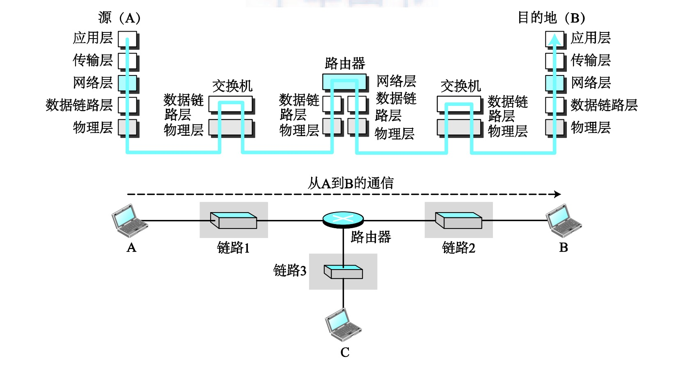
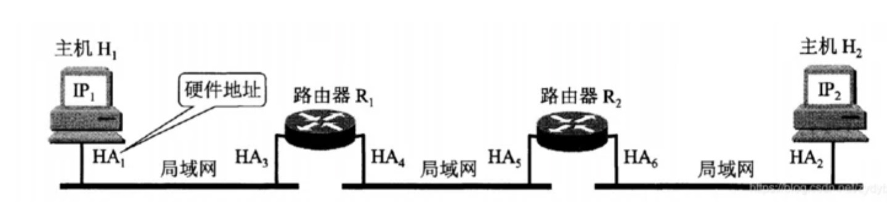
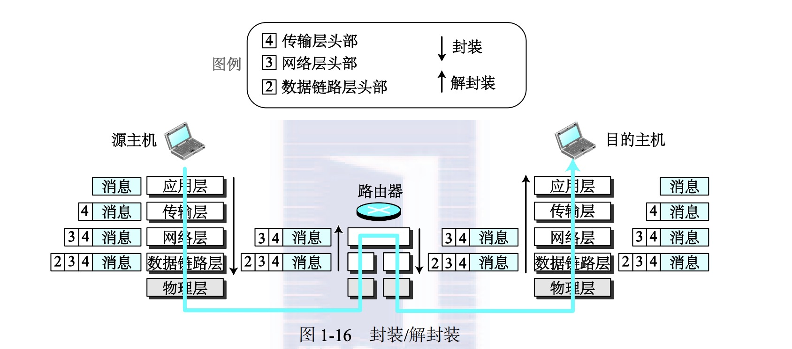
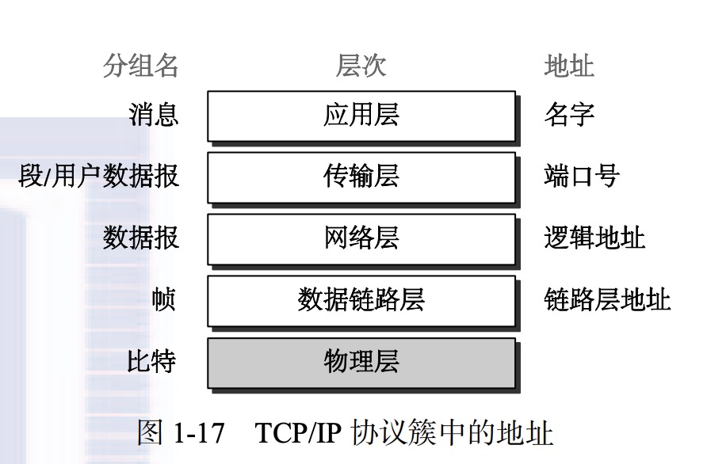
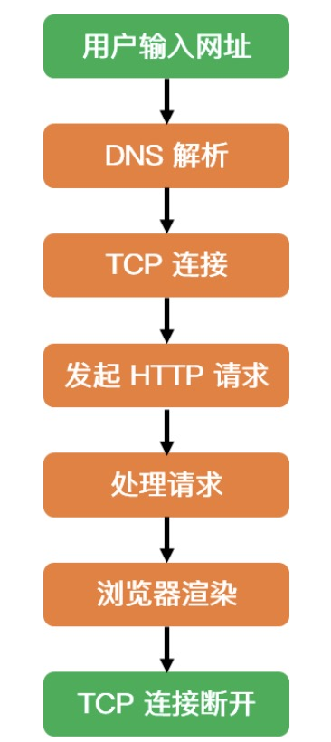

# 网络

网络是由一组具有通讯功能的设备（主机，交换机，路由器等）相连而形成的。

## 局域网

局域网（local area network）通常是私有的。连接一个办公室，大楼或者校园网。在过去一个网络上的所有电脑都连接在一根公共电缆上，这导致了当一个电脑发送一个包给另一个时，其他电脑都要被迫接受选择抛弃。之后有了交换机后交换机可以智能的选择包要去的目的地址从而减轻了局域网中的流量。

## 广域网

广域网相比于局域网可以有更多的地理位置的覆盖，可以是一个城市，一个省乃至一个国家。局域网互联主机，广域网互联交换机，路由器，调制解调器等设备。局域网通常由使用它的组织拥有；广域网通常由电信公司持有。

### 点到点广域网

点到点广域网通过传输介质连接两台设备。

### 交换式广域网

交换式广域网是交换机连接几个点到点的广域网形成的。

## 互联网络

多个网络连接起来就形成了互联网。如图：

# 网络体系结构

## TCP/IP

所谓协议（protocol），其实就是一个群体之间规定的规则，这个规则的目的是为了保证这个群体里面的人可以正常交流。还是回到计算机和网络的通信这边来举例。比如： 如何探测到通信目标、由哪一边先发起通信、使用哪种语言进行通信、怎样结束通信等规则都需要事先确定。不同的硬件、操作系统之间的通信，所有的这一切都需要一种规则。

协议中存在各式各样的内容。从电缆的规格到 IP 地址的选定方法、寻找异地用户的方法、双方建立通信的顺序，以及 Web 页面显示需要处理的步骤，等等。

像这样把与互联网相关联的协议集合起来总称为 TCP/IP。也有说法认为，TCP/IP 是指 TCP 和 IP 这两种协议。还有一种说法认为，TCP/IP 是在 IP 协议的通信过程中，使用到的协议族的统称。

## 层次化结构

为了展示如何利用TCP/IP协议簇进行两台主机的通讯，假设将协议簇用在一个由三个局域网链接组成的小型互联网。每个局域网有个链路层交换机，同时假设局域网连接到一个路由器。如图：

（链路：LAN/WAN）

假设主机A正与主机B进行通讯，在这个通讯过程中涉及5个通讯设备：主机A，链路1，路由器，链路2，主机B。按照设备在互联网中扮演的角色不同，每一台设备包含了几个层次。

两台主机包含了5个层次；源主机A需要在应用层创建一个信息并把他送到下层以便信息在物理层传输给主机B。目标主机需要在物理层接收这个信息然后在依靠其他上面的层把信息传递到应用层。

路由器涉及了三个层次；只要路由器只做路由选择，路由器中就没有传输层或应用层。虽然一个路由器总有一个网络层，但他涉及n个物理层和数据链路层的组合，其中n为路由器连接链路的数目。其主要原因是每条链路可以使用它自己的链路或物理层。

## OSI七层模型，TCP/IP五层协议/四层协议

OSI(Open System Interconnection System)是由国际化标准组织提出的概念模型，试图使各种不同的计算机和网络实现互联。

### 物理层

该层为上层协议提供可靠的数据传输的物理媒体，也就是物理层确保数据可在各物理媒介中传输。（中继器和放大器是两个重要设备在物理层）

### 数据链路层

数据链路层在物理层提供的服务的基础上向网络层提供服务，其最基本的服务是将源自网络层来的数据可靠地传输到相邻节点的目标机网络层。为达到这一目的，数据链路必须具备一系列相应的功能，主要有：如何将数据组合成数据块，在数据链路层中称这种数据块为帧（frame），帧是数据链路层的传送单位；如何控制帧在物理信道上的传输，包括如何处理传输差错，如何调节发送速率以使与接收方相匹配；以及在两个网络实体之间提供数据链路通路的建立、维持和释放的管理。数据链路层在不可靠的物理介质上提供可靠的传输。该层的作用包括：物理地址寻址、数据的成帧、流量控制、数据的检错、重发等。

数据链路层为网络层提供可靠的数据传输

- 基本数据单位为帧

- 主要的协议：以太网协议

- 两个重要设备名称：网桥和交换机。

网络层实现的是主机之间的通信，而链路层实现的是链路之间的通信，所以从下图可以看出，在数据传输过程中，IP数据报的源地址(IP1)和目的地址(IP2)是一直不变的，而MAC地址(硬件地址)却一直随着链路的改变而改变。

### 网络层

网络层的目的是实现两个端系统之间的数据透明传送，具体功能包括寻址和路由选择、连接的建立、保持和终止等。它提供的服务使传输层不需要了解网络中的数据传输和交换技术。如果您想用尽量少的词来记住网络层，那就是"路径选择、路由及逻辑寻址"。

网络层中涉及众多的协议，其中包括最重要的协议，也是TCP/IP的核心协议——IP协议。IP协议非常简单，仅仅提供不可靠、无连接的传送服务。IP协议的主要功能有：无连接数据报传输、数据报路由选择和差错控制。与IP协议配套使用实现其功能的还有地址解析协议ARP、逆地址解析协议RARP、因特网报文协议ICMP、因特网组管理协议IGMP。

- 网络层负责对子网间的数据包进行路由选择。此外，网络层还可以实现拥塞控制、网际互连等功能；

- 基本数据单位为IP数据报；
- 包含的主要协议：
- - IP协议（Internet Protocol，因特网互联协议）;
- - ICMP协议（Internet Control Message Protocol，因特网控制报文协议）;
- - ARP协议（Address Resolution Protocol，地址解析协议）;
- - RARP协议（Reverse Address Resolution Protocol，逆地址解析协议）。
- 重要的设备：路由器。

#### ARP

ARP协议属于网络层的协议，主要作用是实现从IP地址转换为MAC地址。在每个主机或者路由器中都建有一个ARP缓存表，表中有IP地址及IP地址对应的MAC地址。

ARP的工作流程：

1. 在局域网内，主机A要向主机B发送IP数据报时，首先会在主机A的ARP缓存表中查找是否有IP地址及其对应的MAC地址，如果有，则将MAC地址写入到MAC帧的首部，并通过局域网将该MAC帧发送到MAC地址所在的主机B。
2. 如果主机A的ARP缓存表中没有主机B的IP地址及所对应的MAC地址，主机A会在局域网内广播发送一个ARP请求分组。局域网内的所有主机都会收到这个ARP请求分组。
3. 主机B在看到主机A发送的ARP请求分组中有自己的IP地址，会像主机A以单播的方式发送一个带有自己MAC地址的响应分组。
4. 主机A收到主机B的ARP响应分组后，会在ARP缓存表中写入主机B的IP地址及其IP地址对应的MAC地址。
5. 如果主机A和主机B不在同一个局域网内，即使知道主机B的MAC地址也是不能直接通信的，必须通过路由器转发到主机B的局域网才可以通过主机B的MAC地址找到主机B。并且主机A和主机B已经可以通信的情况下，主机A的ARP缓存表中存的并不是主机B的IP地址及主机B的MAC地址，而是主机B的IP地址及该通信链路上的下一跳路由器的MAC地址。这就是上图中的源IP地址和目的IP地址一直不变，而MAC地址却随着链路的不同而改变。
6. 如果主机A和主机B不在同一个局域网，参考上图中的主机H1和主机H2，这时主机H1需要先广播找到路由器R1的MAC地址，再由R1广播找到路由器R2的MAC地址，最后R2广播找到主机H2的MAC地址，建立起通信链路。

### 传输层 

第一个端到端，即主机到主机的层次。传输层负责将上层数据分段并提供端到端的、可靠的或不可靠的传输。此外，传输层还要处理端到端的差错控制和流量控制问题。 传输层的任务是根据通信子网的特性，最佳的利用网络资源，为两个端系统的会话层之间，提供建立、维护和取消传输连接的功能，负责端到端的可靠数据传输。在这一层，信息传送的协议数据单元称为段或报文。 网络层只是根据网络地址将源结点发出的数据包传送到目的结点，而传输层则负责将数据可靠地传送到相应的端口。 有关网络层的重点：

- 传输层负责将上层数据分段并提供端到端的、可靠的或不可靠的传输以及端到端的差错控制和流量控制问题；
-  包含的主要协议：TCP协议（Transmission Control Protocol，传输控制协议）、UDP协议（User Datagram Protocol，用户数据报协议）；
- 3> 重要设备：网关。

### 会话层

会话层管理主机之间的会话进程，即负责建立、管理、终止进程之间的会话。会话层还利用在数据中插入校验点来实现数据的同步。

### 表示层

表示层对上层数据或信息进行变换以保证一个主机应用层信息可以被另一个主机的应用程序理解。表示层的数据转换包括数据的加密、压缩、格式转换等。

### 应用层

为操作系统或网络应用程序提供访问网络服务的接口。

会话层、表示层和应用层重点：

- 数据传输基本单位为报文；
- 包含的主要协议：FTP（文件传送协议）、Telnet（远程登录协议）、DNS（域名解析协议）、SMTP（邮件传送协议），POP3协议（邮局协议），HTTP协议（Hyper Text Transfer Protocol）。

## 封装和解装

在Internet分层协议中，分装和解装是一个重要概念，如图显示了小型互联网的封装和解装过程：

Note：由于在链路层交换机中没有封装解装过程，所以没有显示链路交换机的层次。

### 源主机的封装

- 在应用层将交换的数据统称为消息（message）。消息通常不包含头部和尾部，即使包含也称为消息。

- 在传输层把这个消息称为有效载荷，这个消息被传输层加上传输层的头部。头部包含了源和目的应用程序的标识符和一些投递该信息所需的更多的信息例如流量控制，差错控制和拥堵控制所需信息。其结果为一个传输层分组，该分组在TCP中称为段（segment），在UDP中称为用户数据报（user datagram），然后传输层传递该分组到网络层。
- 在网络层把传输层传来的数据添加自己的头部，头部包含源和目的主机的地址，以及用于头部差错检查，分片的信息等其他信息。其结果称之为数据报（datagram）。然后网络层把数据报传递给链路层。
- 在数据链路层把网络层的数据报添加自己的头部，该头部含有主机或下一跳步（路由器）的链路层地址，其结果称之为帧。该帧被传到物理层进行传输。

### 路由器的解封装和封装

由于路由器连接两个或多个链路，所以路由器既要解封又要封装。

* 在比特集被投递到数据链路层后，这层把帧解封成数据报投递给网络层

* 在网络层检查头部的源地址和目标地址，查阅他的转发表以寻求该数据报的下一跳。除非数据报太大以至于不能传输到下一个链路要进行切片处理，不然网络层不改变数据报的内容。然后数据报被传递到下一个链路的数据链路层。
* 下一链路的数据链路层将数据封装成帧将其传输到物理层传输。

### 目标主机的解封装

在目标主机端，每层只需解封装相应的头部，然后把信息传递到应用层即可。

## 地址

协议分层模型中另一个重要概念就是地址，在这种模型中一对层次之间存在逻辑通讯。包含两方的任意通讯都需要两个地址：源地址和目标地址。物理层不需要地址所以我们需要四对地址。

应用层：通常使用域名如baidu.com来表示提供服务的站点，用adc@gmail.com来表示邮箱

传输层：端口号指向源和目的地的应用程序，端口号是本地地址，用于区分同一时间运行的几个程序。

# 域名系统 DNS

DNS的定义：DNS的全称是domain name system，即域名系统。DNS是因特网上作为域名和IP地址相互映射的一个分布式数据库，能够使用户更方便的去访问互联网而不用去记住能够被机器直接读取的IP地址。比如大家访问百度，更多地肯定是访问www.baidu.com，而不是访问112.80.248.74，因为这几乎无规则的IP地址实在太难记了。DNS要做的就是将www.baidu.com解析成112.80.248.74。

**主机向本地域名服务器的查询一般是采用递归查询，而本地域名服务器向根域名的查询一般是采用迭代查询。**

递归查询主机向本地域名发送查询请求报文，而本地域名服务器不知道该域名对应的IP地址时，本地域名会继续向根域名发送查询请求报文，不是通知主机自己向根域名发送查询请求报文。迭代查询是，本地域名服务器向根域名发出查询请求报文后，根域名不会继续向顶级域名服务器发送查询请求报文，而是通知本地域名服务器向顶级域名发送查询请求报文。

1. 在浏览器中输入www.baidu.com域名，操作系统会先检查自己本地的hosts文件是否有这个域名的映射关系，如果有，就先调用这个IP地址映射，完成域名解析。
2. 如果hosts文件中没有，则查询本地DNS解析器缓存，如果有，则完成地址解析。
3. 如果本地DNS解析器缓存中没有，则去查找本地DNS服务器，如果查到，完成解析。
4. 如果没有，则本地服务器会向根域名服务器发起查询请求。根域名服务器会告诉本地域名服务器去查询哪个顶级域名服务器。
5. 本地域名服务器向顶级域名服务器发起查询请求，顶级域名服务器会告诉本地域名服务器去查找哪个权限域名服务器。
6. 本地域名服务器向权限域名服务器发起查询请求，权限域名服务器告诉本地域名服务器www.baidu.com所对应的IP地址。
7. 本地域名服务器告诉主机www.baidu.com所对应的IP地址。

# 网络解析全过程

1. DNS 解析：当用户输入一个网址并按下回车键的时候，浏览器获得一个域名，而在实际通信过程中，我们需要的是一个 IP 地址，因此我们需要先把域名转换成相应 IP 地址。【具体细节参看问题 16，17】

2. TCP 连接：浏览器通过 DNS 获取到 Web 服务器真正的 IP 地址后，便向 Web 服务器发起 TCP 连接请求，通过 TCP 三次握手建立好连接后，浏览器便可以将 HTTP 请求数据发送给服务器了。【三次握手放在传输层详细讲解】

3. 发送 HTTP 请求：浏览器向 Web 服务器发起一个 HTTP 请求，HTTP 协议是建立在 TCP 协议之上的应用层协议，其本质是在建立起的TCP连接中，按照HTTP协议标准发送一个索要网页的请求。在这一过程中，会涉及到负载均衡等操作。

**拓展：什么是负载均衡？**

**负载均衡，英文名为 Load Balance，其含义是指将负载（工作任务）进行平衡、分摊到多个操作单元上进行运行，例如 FTP 服务器、Web 服务器、企业核心服务器和其他主要任务服务器等，从而协同完成工作任务。负载均衡建立在现有的网络之上，它提供了一种透明且廉价有效的方法扩展服务器和网络设备的带宽、增加吞吐量、加强网络处理能力并提高网络的灵活性和可用性。**

**负载均衡是分布式系统架构设计中必须考虑的因素之一，例如天猫、京东等大型用户网站中为了处理海量用户发起的请求，其往往采用分布式服务器，并通过引入反向代理等方式将用户请求均匀分发到每个服务器上，而这一过程所实现的就是负载均衡。**

4. 处理请求并返回：服务器获取到客户端的 HTTP 请求后，会根据 HTTP 请求中的内容来决定如何获取相应的文件，并将文件发送给浏览器。

5. 浏览器渲染：浏览器根据响应开始显示页面，首先解析 HTML 文件构建 DOM 树，然后解析 CSS 文件构建渲染树，等到渲染树构建完成后，浏览器开始布局渲染树并将其绘制到屏幕上。

6. 断开连接：客户端和服务器通过四次挥手终止 TCP 连接。

# HTTP

## HTTP头部包含哪些信息：

HTTP 头部本质上是一个传递额外重要信息的键值对。主要分为：通用头部，请求头部，响应头部和实体头部。

# 设计原则

开闭原则：一个软件实体如类、模块和函数应该对修改封闭，对扩展开放。
单一职责原则：一个类只做一件事，一个类应该只有一个引起它修改的原因。
里氏替换原则：子类应该可以完全替换父类。也就是说在使用继承时，只扩展新功能，而不要破坏父类原有的功能。
依赖倒置原则：细节应该依赖于抽象，抽象不应依赖于细节。把抽象层放在程序设计的高层，并保持稳定，程序的细节变化由低层的实现层来完成。
迪米特法则：又名“最少知道原则”，一个类不应知道自己操作的类的细节，换言之，只和朋友谈话，不和朋友的朋友谈话。
接口隔离原则：客户端不应依赖它不需要的接口。如果一个接口在实现时，部分方法由于冗余被客户端空实现，则应该将接口拆分，让实现类只需依赖自己需要的接口方法。

# 数据库范式

**一、三大范式通俗解释：**

（1）简单归纳：

　　第一范式（1NF）：字段不可分；
　　第二范式（2NF）：有主键，非主键字段依赖主键；
　　第三范式（3NF）：非主键字段不能相互依赖。

（2）解释：

　　1NF：原子性。 字段不可再分,否则就不是关系数据库;；
　　2NF：唯一性 。一个表只说明一个事物；
　　3NF：每列都与主键有直接关系，不存在传递依赖。
