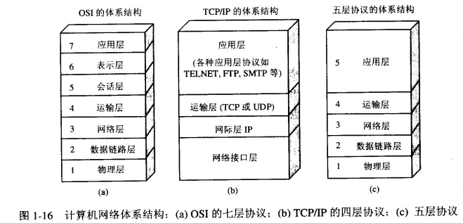

# 网络体系结构
## OSI七层模型，TCP/IP五层协议/四层协议

OSI(Open System Interconnection System)是由国际化标准组织提出的概念模型，试图使各种不同的计算机和网络实现互联。

### 应用层

该层为上层协议提供可靠的数据传输的物理媒体，也就是物理层确保数据可在各物理媒介中传输。（中继器和放大器是两个重要设备在物理层）

### 数据链路层

数据链路层在物理层提供的服务的基础上向网络层提供服务，其最基本的服务是将源自网络层来的数据可靠地传输到相邻节点的目标机网络层。为达到这一目的，数据链路必须具备一系列相应的功能，主要有：如何将数据组合成数据块，在数据链路层中称这种数据块为帧（frame），帧是数据链路层的传送单位；如何控制帧在物理信道上的传输，包括如何处理传输差错，如何调节发送速率以使与接收方相匹配；以及在两个网络实体之间提供数据链路通路的建立、维持和释放的管理。数据链路层在不可靠的物理介质上提供可靠的传输。该层的作用包括：物理地址寻址、数据的成帧、流量控制、数据的检错、重发等。

数据链路层为网络层提供可靠的数据传输

- 基本数据单位为帧

- 主要的协议：以太网协议

- 两个重要设备名称：网桥和交换机。

## TCP/IP

所谓协议（protocol），其实就是一个群体之间规定的规则，这个规则的目的是为了保证这个群体里面的人可以正常交流。还是回到计算机和网络的通信这边来举例。比如： 如何探测到通信目标、由哪一边先发起通信、使用哪种语言进行通信、怎样结束通信等规则都需要事先确定。不同的硬件、操作系统之间的通信，所有的这一切都需要一种规则。

协议中存在各式各样的内容。从电缆的规格到 IP 地址的选定方法、寻找异地用户的方法、双方建立通信的顺序，以及 Web 页面显示需要处理的步骤，等等。

像这样把与互联网相关联的协议集合起来总称为 TCP/IP。也有说法认为，TCP/IP 是指 TCP 和 IP 这两种协议。还有一种说法认为，TCP/IP 是在 IP 协议的通信过程中，使用到的协议族的统称。

